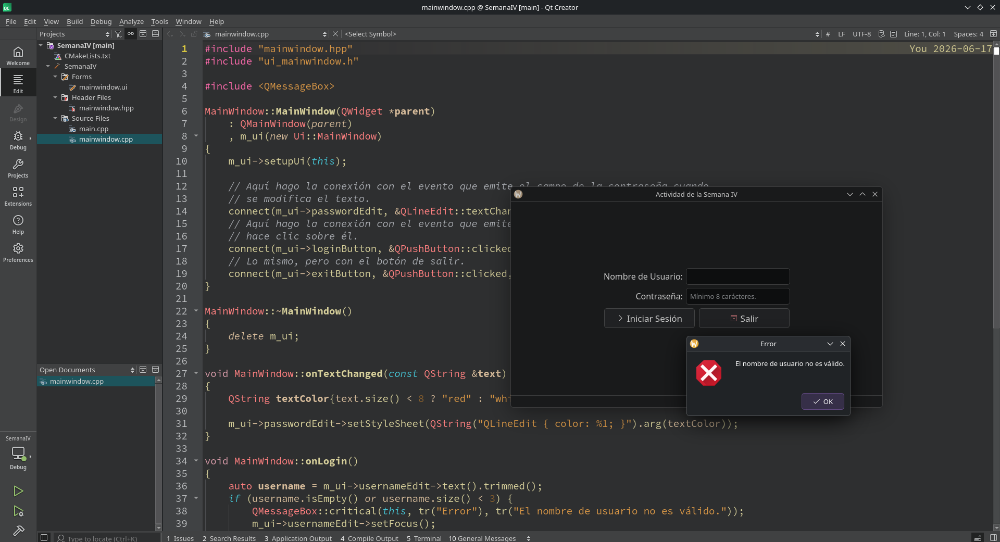
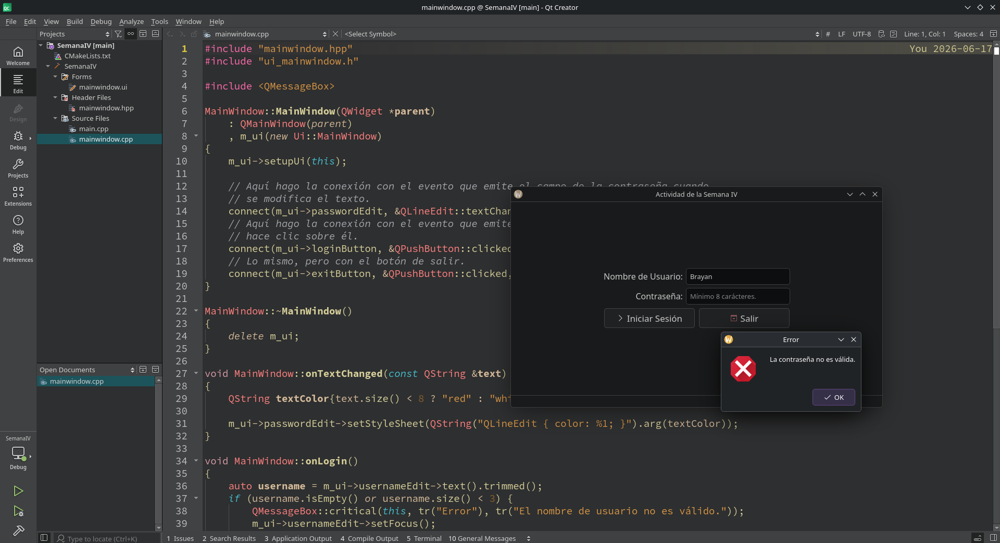
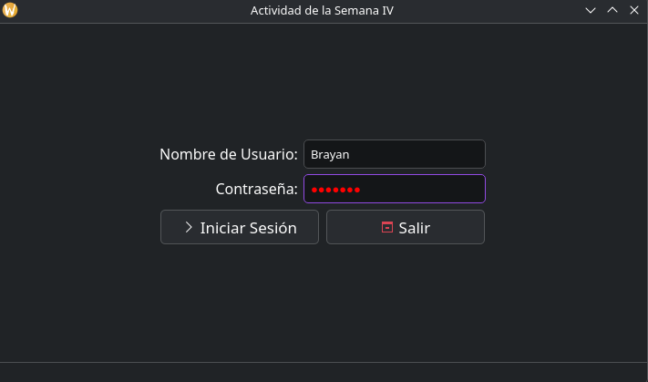
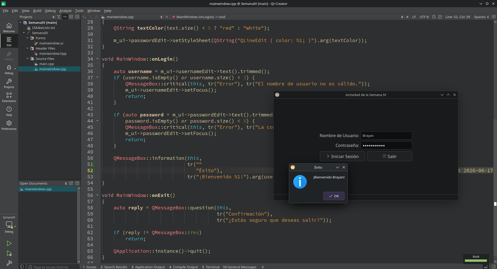

# ActividadSemanaIV
Actividad de la Semana IV de Programación II.

# Explicación
Al abrir el programa nos encontramos con una ventana en la cual hay 4 controles con los que podemos interactuar: campo para nombre de usuario, para contraseña. Botones para iniciar sesión y para cerrar el programa.

## Campo contraseña
Al momento de escribir la contraseña, se detecta el evento `textChanged` y se le cambia el color al texto a rojo si la longitud es muy corta y se reestablece tan pronto supere el criterio.

## Botón de iniciar sesión
Al hacer clic en el botón de iniciar sesión, se detecta el evento `clicked` y se realizan las comprobaciones pertinentes: que ni el nombre ni la contraseña estén vacías y que su longitud supere el criterio establecido: mínimo 3 carácteres para el nombre de usuario y 8 para la contraseña.

Si se superan las pruebas, aparece un `MessageBox` en pantalla dándole la bienvenida al usuario.

## Botón de salir
Al hacer clic en el botón de salir, aparece un `MessageBox` en pantalla preguntándole al usuario si está de querer salir. Si es así, es decir, hace clic en el botón `Sí`/`Yes`, la aplicación se cierra. En caso contrario, es decir, que haga clic en `No` o cierre el `MessageBox` no ocurre nada.

## Capturas de Pantalla

